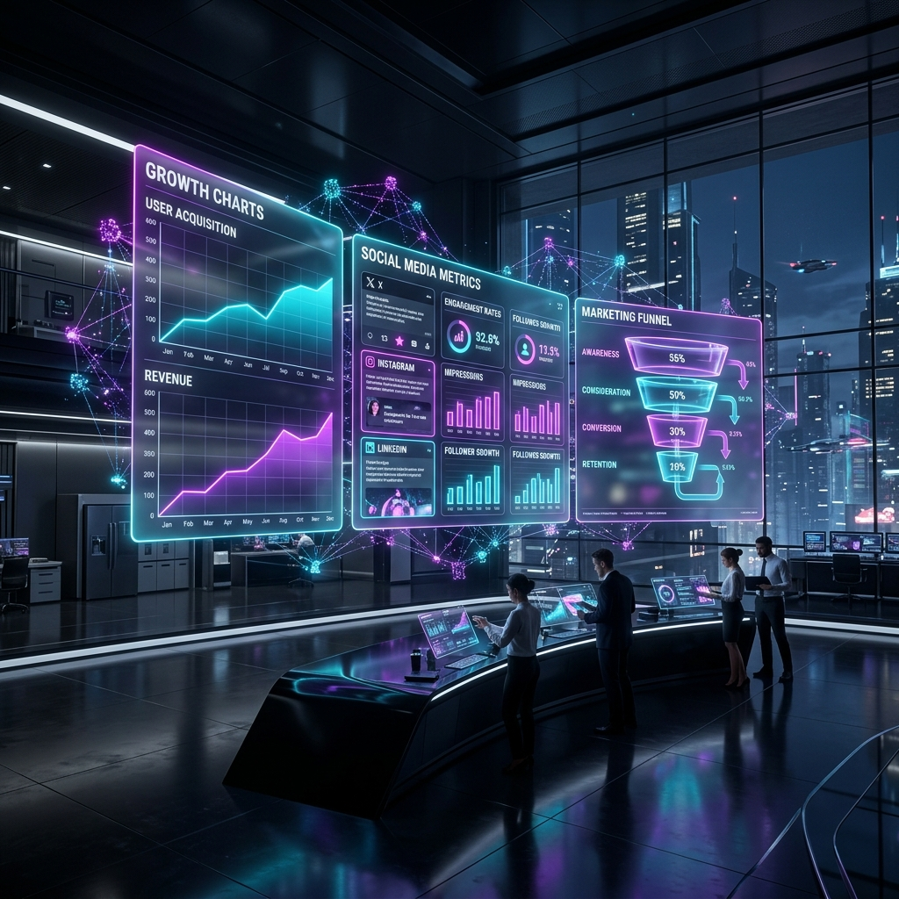

<!-- HEADER ANIMATION -->

  

<!-- TYPING ANIMATION -->

  

 

  
  
  

---

### 🎯 The Vibe: Marketing Strategist Who Prompts

I am a BBA candidate specializing in marketing and operations, but I don't just write copy or study theory. I use advanced AI prompting to build, brand, and distribute digital products. **Execution > Ideas.**

- 🧠 **Prompt-Driven Output:** Leveraging AI to generate brand systems, high-retention content frameworks, and functional code architectures.
- 📈 **Growth Focus:** Scaling organic reach through sharp hooks and bootstrapped case studies.
- 🎨 **Aesthetic Discipline:** Strict adherence to modern UI trends (Liquid Glass, glassmorphism) and seamless loop animations.

  

---

### 🚀 What I'm Building (Marketing × AI)

| Project | Focus Area | Impact / Tech |
| :--- | :--- | :--- |
| **[Founder's Feed](https://instagram.com/foundersfeed)** | **Content & Growth** | Scaling organic reach via bootstrapped Indian founder case studies. High-engagement carousel strategies with sharp, uncomfortable hooks. (Grew to 600+ network, 25%+ engagement). |
| **[Skope](https://github.com/anuragggg2004/skope)** | **Brand Positioning** | AI career counselor diagnostics. Built complete brand identity, typography, and positioning. Core tagline: *"Find your scope in life."* |
| **[CineVault](#)** | **Product & UI** | Prompt-engineered a functional React movie database utilizing TMDB API, emphasizing state management and a "Liquid Glass" aesthetic. |
| **A.IX** | **Multi-Industry Strategy** | Overarching company framework directing multiple sub-projects and operational structures. |

---

### 📦 The Marketing & Operations Pipeline (Animated)

To coordinate SCM operations (Welspun procurement) and marketing campaigns (Founder's Feed), I align workflows into a single conversion funnel. Here is the active data flow of my digital ecosystem:

  

---

### 🛠️ The Stack: Tools & Prompts

  
  **Marketing & Analytics**  
  
  
  
  
  
  
   **AI & Vibe Coding** 
  
  
  
  
  

---

### 📊 The Metrics

  
  

 

<!-- SNAKE ANIMATION -->

  <h4>🐍 Code Contributions</h4>
  <picture>
    <source media="(prefers-color-scheme: dark)" srcset="https://raw.githubusercontent.com/anuragggg2004/anuragggg2004/output/github-contribution-grid-snake-dark.svg">
    <source media="(prefers-color-scheme: light)" srcset="https://raw.githubusercontent.com/anuragggg2004/anuragggg2004/output/github-contribution-grid-snake.svg">
    
  </picture>

<!-- FOOTER ANIMATION -->

  

